# Todo-sobre-java-androidstudio

Principal screen:

When "Calculadora CB" is pressed:

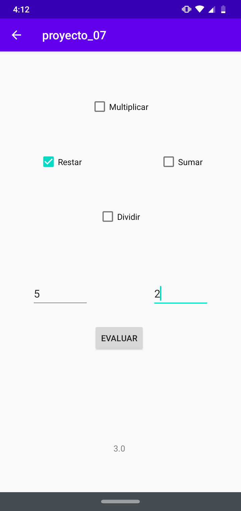

When "Calcular divisas" is pressed:

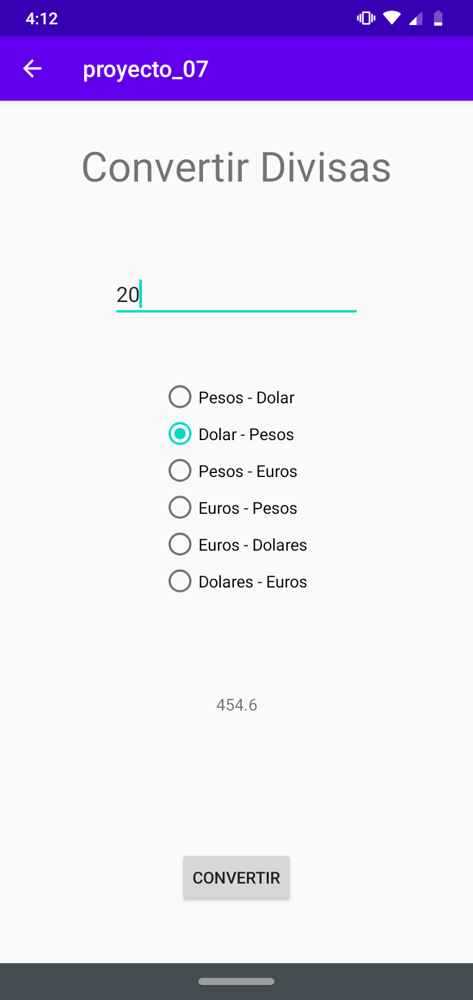

When "Toggle button/switch" is pressed:

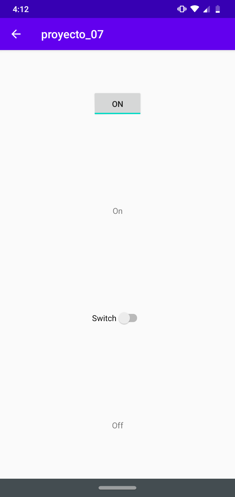

When "Persistencia de parametros" is pressed:

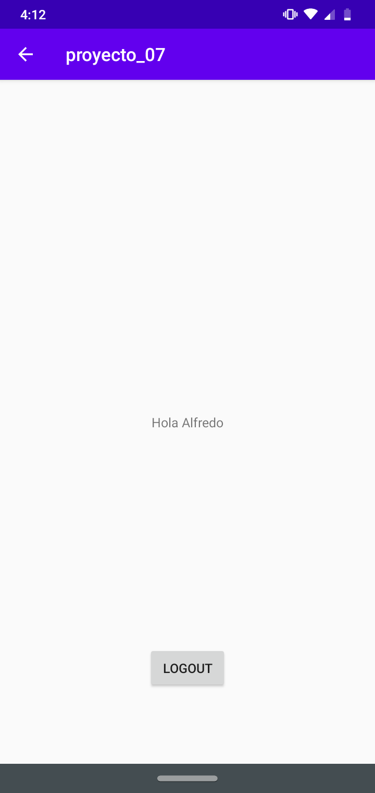

When "Login" is pressed:
User: Alfredo
Password: 123
*Select a blood type

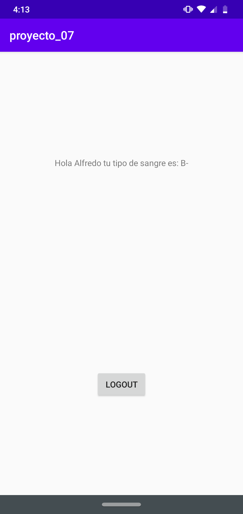

When "Save" is pressed:
this will save anything that you write in the editText
When "Read" is pressed:
this will read anything that you previously wrote in the editText

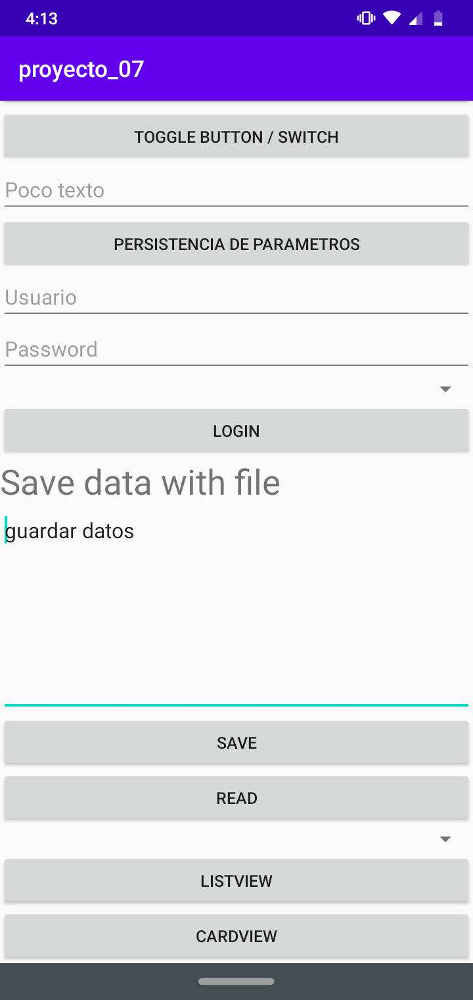

When a item from "spinner" is selected:

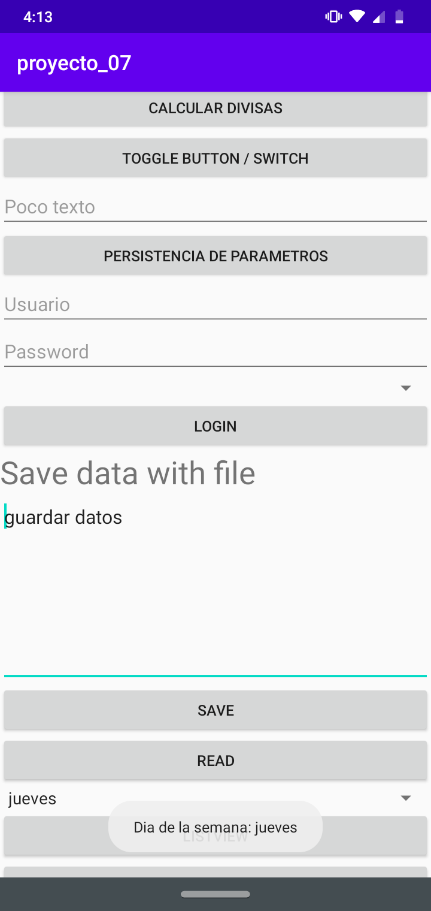

When "ListView" is pressed:

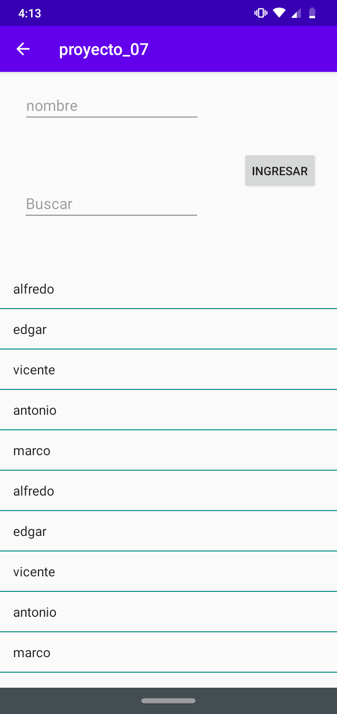

When "CardView" is pressed:

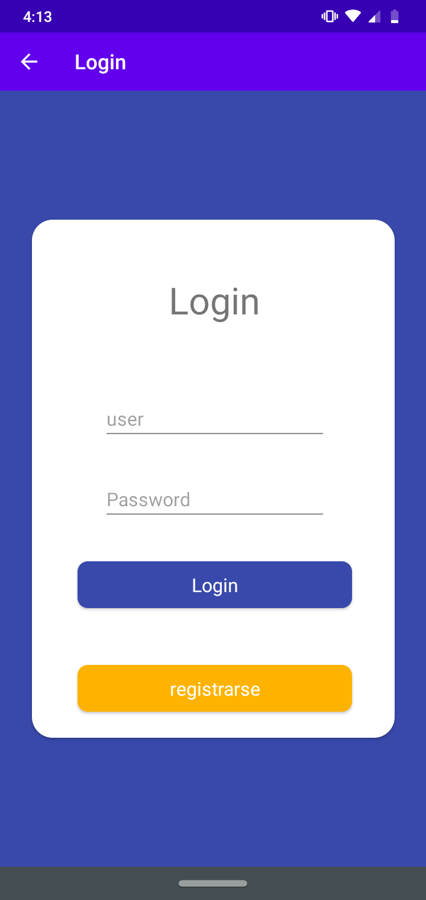

When "CardView//login" is pressed:

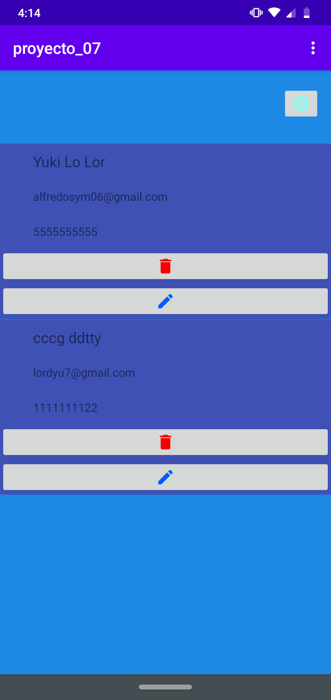

When "CardView//login//+" is pressed:

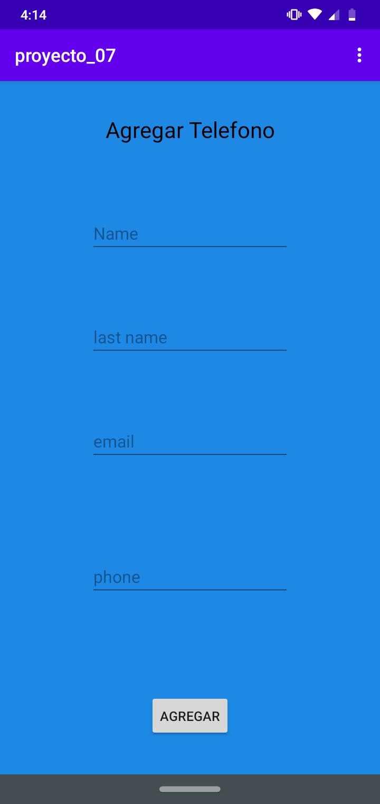

When "CardView//login//menu" is pressed:

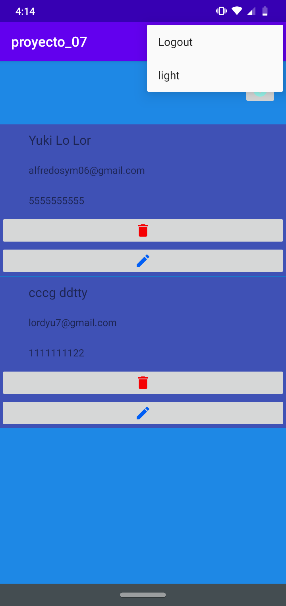

When "CardView//registrarse" is pressed:

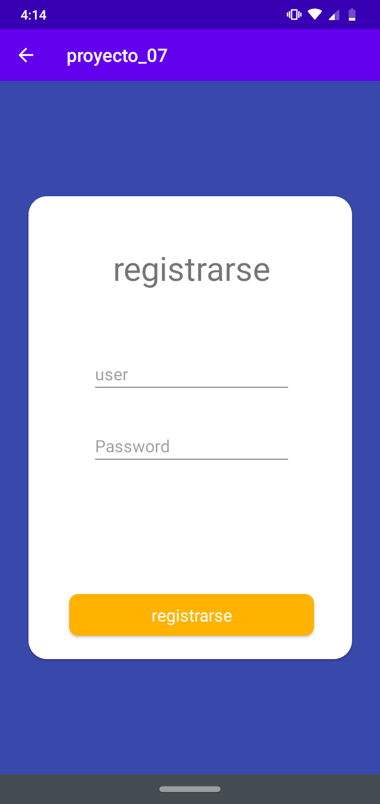
